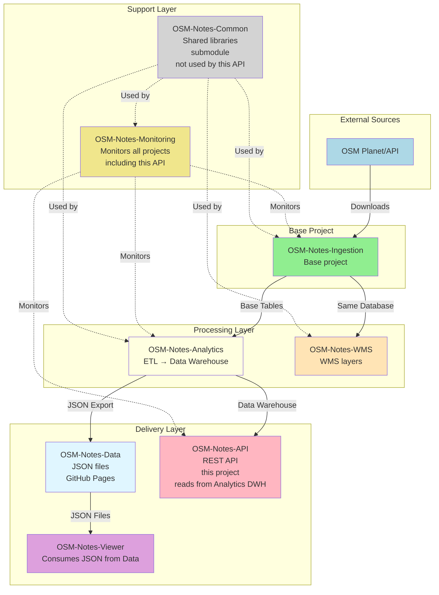

# OSM Notes API

REST API for OSM Notes Analytics and Ingestion. Unified programmatic access to user profiles, country analytics, advanced search capabilities, rankings, comparisons, and real-time metrics. Extends OSM API 0.6 with specialized analytics features.

## 📋 Description

OSM Notes API provides programmatic access to OpenStreetMap notes analytics data, including:

- **User Profiles**: Detailed statistics of contributors
- **Country Analytics**: Aggregated metrics by country
- **Advanced Search**: Complex filters and dynamic queries
- **Rankings**: User and country classifications
- **Comparisons**: Comparative analysis between entities
- **Trends**: Temporal data analysis
- **Notes and Comments**: Access to OSM notes and their comments

## ⚠️ Important Note

**This API is COMPLEMENTARY to the static JSON system, NOT a replacement.**

- ✅ **JSON system maintained**: The Viewer and other consumers continue using static JSON files
- ✅ **API is additional**: For use cases requiring dynamic queries or integrations
- ✅ **Both coexist**: Each system is used according to the specific use case

## Requirements

For complete installation instructions, see **[Installation and Dependencies Guide](docs/Installation_Dependencies.md)**.

### Application Requirements

- **Node.js** >= 18.0.0
- **npm** >= 9.0.0
- **PostgreSQL** 15+ (with access to `osm_notes_dwh` database)
- **Redis** 7+ (optional but recommended for caching and rate limiting)

### Internal Repository Requirements

- **OSM-Notes-Analytics** ⚠️ **REQUIRED**
  - This API reads from the Analytics data warehouse (`osm_notes_dwh` database)
  - Required schemas: `dwh` (data warehouse with datamarts)
  - **Install Analytics FIRST** before installing API

## 🚀 Quick Start

### Installation

```bash
# Clone repository
git clone https://github.com/OSM-Notes/OSM-Notes-API.git
cd OSM-Notes-API

# Install dependencies
npm install

# Configure environment variables
cp .env.example .env
# Edit .env with your configurations

# Build TypeScript
npm run build

# Load mock data (optional, for testing)
# Requires OSM-Notes-Ingestion repository cloned
./scripts/load_mock_data.sh

# Start application
npm start
```

### With Docker

```bash
# Start services
docker compose -f docker/docker-compose.yml up -d

# View logs
docker compose -f docker/docker-compose.yml logs -f api
```

See [docs/INSTALLATION.md](docs/Installation.md) for detailed instructions.

### Quick Usage Examples

**Health Check**:

```bash
curl -H "User-Agent: MyApp/1.0 (contact@example.com)" \
     http://localhost:3000/health
```

**Get a Note**:

```bash
curl -H "User-Agent: MyApp/1.0 (contact@example.com)" \
     http://localhost:3000/api/v1/notes/12345
```

**Search Notes**:

```bash
curl -H "User-Agent: MyApp/1.0 (contact@example.com)" \
     "http://localhost:3000/api/v1/notes?status=open&country=42&limit=10"
```

**Get User Profile**:

```bash
curl -H "User-Agent: MyApp/1.0 (contact@example.com)" \
     http://localhost:3000/api/v1/users/12345
```

**Get Country Profile**:

```bash
curl -H "User-Agent: MyApp/1.0 (contact@example.com)" \
     http://localhost:3000/api/v1/countries/42
```

**Get Global Analytics**:

```bash
curl -H "User-Agent: MyApp/1.0 (contact@example.com)" \
     http://localhost:3000/api/v1/analytics/global
```

**Interactive API Documentation**:

- Swagger UI: `http://localhost:3000/docs`
- OpenAPI JSON: `http://localhost:3000/docs/json`

See [docs/USAGE.md](docs/Usage.md) for complete usage guide.

## Recommended Reading Path

**New to this project?** Follow this reading path to understand the API (~1-2 hours):

### For API Consumers

1. **Start Here** (15 min)
   - Read this README.md (you're here!)
   - Understand the project purpose and main features
   - Review the Quick Start guide above

2. **API Usage** (30 min)
   - Read [docs/USAGE.md](docs/Usage.md) - Complete usage manual with examples
   - Review [docs/API.md](docs/API.md) - Complete API reference documentation
   - Try the Quick Usage Examples above

3. **API Documentation** (15 min)
   - Visit Swagger UI: `http://localhost:3000/docs` (when running locally)
   - Review OpenAPI specification: [docs/api/](docs/api/)
   - Understand authentication and rate limiting

**Total time: ~1 hour** for basic API usage.

### For Developers

1. **Foundation** (45 min)
   - [docs/ARCHITECTURE.md](docs/Architecture.md) - System architecture (30 min)
   - [docs/DEVELOPMENT.md](docs/Development.md) - Development guidelines (15 min)

2. **Setup and Configuration** (30 min)
   - [docs/INSTALLATION.md](docs/Installation.md) - Installation guide (15 min)
   - [docs/DATABASE_SCHEMA.md](docs/Database_Schema.md) - Database requirements (15 min)

3. **Testing and Quality** (30 min)
   - [docs/TESTING.md](docs/Testing.md) - Testing documentation (20 min)
   - [CONTRIBUTING.md](CONTRIBUTING.md) - Contribution guidelines (10 min)

4. **Deep Dive** (as needed)
   - [docs/PERFORMANCE.md](docs/Performance.md) - Performance optimization
   - [docs/MONITORING.md](docs/Monitoring.md) - Monitoring setup
   - [docs/adr/](docs/adr/) - Architecture Decision Records

**Total time: ~2 hours** for complete developer overview.

### For System Administrators

1. **Deployment** (1 hour)
   - [docs/INSTALLATION.md](docs/Installation.md) - Installation guide (20 min)
   - [docs/DEPLOYMENT.md](docs/Deployment.md) - Production deployment (20 min)
   - [docs/DEPLOYMENT_PRODUCTION.md](docs/Deployment_Production.md) - Specific production guide (20 min)

2. **Operations** (45 min)
   - [docs/RUNBOOK.md](docs/Runbook.md) - Operations runbook (20 min)
   - [docs/MONITORING.md](docs/Monitoring.md) - Monitoring setup (15 min)
   - [docs/TROUBLESHOOTING.md](docs/Troubleshooting.md) - Common issues (10 min)

3. **Compliance and Operations** (30 min)
   - [docs/operations/DISASTER_RECOVERY.md](docs/operations/Disaster_Recovery.md) - Disaster recovery
   - [docs/operations/BACKUP_STRATEGY.md](docs/operations/Backup_Strategy.md) - Backup procedures
   - [docs/SLA.md](docs/Sla.md) - Service Level Agreements

**Total time: ~2.5 hours** for complete operations overview.

## Entry Points

**Main entry points** for using and operating the API:

### Application Entry Points

1. **Start the API Server**
   ```bash
   npm start              # Production mode (requires build first)
   npm run dev            # Development mode with hot reload
   ```

2. **Docker Entry Points**
   ```bash
   # Start all services (API + PostgreSQL + Redis)
   docker compose -f docker/docker-compose.yml up -d
   
   # Start with monitoring (Prometheus + Grafana)
   docker compose -f docker/docker-compose.yml --profile monitoring up -d
   ```

### API Endpoints (HTTP Entry Points)

**Base URL**: `http://localhost:3000` (default)

- **Health Check**: `GET /health` - Service health status
- **API Documentation**: `GET /docs` - Swagger UI interactive documentation
- **OpenAPI Spec**: `GET /docs/json` - OpenAPI JSON specification

**Main API Endpoints**:
- `GET /api/v1/users/:id` - Get user profile
- `GET /api/v1/countries/:id` - Get country profile
- `GET /api/v1/notes` - Search notes
- `GET /api/v1/notes/:id` - Get specific note
- `GET /api/v1/analytics/global` - Global analytics

See [docs/API.md](docs/API.md) for complete API reference.

### Development Entry Points

1. **Build and Type Check**
   ```bash
   npm run build          # Compile TypeScript
   npm run type-check     # Verify types without building
   ```

2. **Testing**
   ```bash
   npm test               # Run all tests (master test command)
   npm run test:unit      # Unit tests only
   npm run test:integration  # Integration tests only
   ```
   
   **Master Test Command**: `npm test` - Executes all tests using Jest

3. **Code Quality**
   ```bash
   npm run lint           # Check code style
   npm run format         # Format code
   ```

### Operations Entry Points

1. **Health Monitoring**
   ```bash
   curl http://localhost:3000/health
   ```

2. **View Logs**
   ```bash
   # Docker
   docker compose -f docker/docker-compose.yml logs -f api
   
   # PM2
   pm2 logs osm-notes-api
   ```

3. **Restart Service**
   ```bash
   # Docker
   docker compose -f docker/docker-compose.yml restart api
   
   # PM2
   pm2 restart osm-notes-api
   ```

See [docs/RUNBOOK.md](docs/Runbook.md) for complete operations procedures.

## 📚 Documentation

### Getting Started
- [Installation](docs/Installation.md) - Complete installation guide
- [Usage](docs/Usage.md) - API usage manual with examples
- [API Reference](docs/API.md) - Complete API reference documentation
- [API Reference (OpenAPI)](docs/api/) - OpenAPI/Swagger documentation

### Operations & Deployment
- [Deployment Guide](docs/Deployment.md) - Production deployment instructions
- [Production Deployment (192.168.0.7)](docs/Deployment_Production.md) - Specific guide for production server
- [Operations Runbook](docs/Runbook.md) - Operational procedures and runbook
- [Troubleshooting](docs/Troubleshooting.md) - Common issues and solutions
- [CI/CD Guide](docs/CI_CD.md) - Continuous Integration and Deployment

### Performance & Monitoring
- [Performance Guide](docs/Performance.md) - Performance optimization and benchmarking
- [SLA/SLOs](docs/Sla.md) - Service Level Agreements and Objectives
- [Monitoring Guide](docs/Monitoring.md) - Prometheus and Grafana setup

### Operations & Compliance
- [Disaster Recovery](docs/operations/Disaster_Recovery.md) - Disaster recovery procedures
- [Backup Strategy](docs/operations/Backup_Strategy.md) - Backup and restore procedures
- [Capacity Planning](docs/operations/Capacity_Planning.md) - Capacity planning guide
- [Terms of Service](docs/legal/Terms_Of_Service.md) - API terms of service
- [Privacy Policy](docs/legal/Privacy_Policy.md) - Privacy policy (GDPR compliant)

### Development
- [Database Schema](docs/Database_Schema.md) - Database schema and data requirements
- [Database User Setup](docs/Database_User_Setup.md) - Create read-only database user
- [Redis Setup (Optional)](docs/Redis_Optional.md) - Redis configuration (optional but recommended)
- [Redis Troubleshooting](docs/Troubleshooting_Redis.md) - Fix Redis connection issues
- [Testing Guide](docs/Testing.md) - Testing documentation
- [Security Testing](docs/Testing_Security.md) - OWASP ZAP security testing guide
- [Development Guide](docs/Development.md) - Development guidelines
- [Contributing](CONTRIBUTING.md) - Contributor guide
- [Architecture Decision Records](docs/adr/) - ADRs documenting technical decisions

### Reference
- [Changelog](CHANGELOG.md) - Change history
- [API Versioning](docs/API_Versioning.md) - API versioning strategy

## 🏗️ Project Structure

```text
OSM-Notes-API/
├── src/                    # Source code
│   ├── config/            # Configuration
│   ├── routes/            # API routes
│   ├── controllers/       # Controllers
│   ├── services/          # Business logic
│   ├── middleware/        # Custom middleware
│   ├── utils/             # Utilities
│   └── types/             # TypeScript types
├── tests/                  # Tests
│   ├── unit/              # Unit tests
│   ├── integration/       # Integration tests
│   └── load/              # Load tests
├── docs/                   # Documentation
│   ├── INSTALLATION.md    # Installation manual
│   ├── USAGE.md           # Usage manual
│   └── api/               # OpenAPI documentation
├── docker/                 # Docker configuration
└── package.json           # Dependencies and scripts
```

## 🛠️ Available Scripts

### Development
```bash
npm run build          # Build TypeScript
npm start              # Run compiled application
npm run dev            # Development with hot reload
npm run type-check     # Verify TypeScript types
```

### Testing
```bash
npm test               # Run all tests
npm run test:unit      # Unit tests only
npm run test:integration  # Integration tests only
npm run test:coverage  # Tests with coverage report
npm run test:watch     # Run tests in watch mode
npm run test:light     # Run unit tests with 1 worker (for performance)
npm run test:integration:single  # Run integration tests sequentially
```

### Code Quality
```bash
npm run lint           # Run ESLint
npm run lint:fix       # Fix ESLint errors automatically
npm run format         # Format code with Prettier
npm run format:check   # Check code formatting
```

### Performance & Database
```bash
# Run performance benchmarks
./scripts/run_benchmarks.sh

# Create database indexes
psql -h $DB_HOST -U $DB_USER -d $DB_NAME -f scripts/create_indexes.sql

# Analyze query performance
psql -h $DB_HOST -U $DB_USER -d $DB_NAME -f scripts/analyze_queries.sql
```

### Load Testing (requires k6)
```bash
# Install k6 first (see tests/load/README.md)
k6 run tests/load/users.js
k6 run tests/load/notes.js
k6 run tests/load/analytics.js
k6 run tests/load/all-endpoints.js
```

## 🔒 Security

- **User-Agent required**: All requests must include a valid User-Agent with format `AppName/Version (Contact)`
- **Rate Limiting**: 50 requests/15min for anonymous users, 1000 req/hour for authenticated
- **Anti-abuse protection**: Automatic blocking of known AIs and bots without OAuth
- **Security headers**: Helmet.js configured with security best practices
- **Input validation**: All inputs validated with Joi schemas
- **Optional OAuth**: Available for advanced features (Phase 5)

See [docs/USAGE.md](docs/Usage.md) and [docs/security/](docs/security/) for more security details.

## 📈 Monitoring & Observability

- **Prometheus Metrics**: Available at `/metrics` endpoint
- **Grafana Dashboards**: Pre-configured dashboards for:
  - Request rate and latency (P50, P95, P99)
  - Error rates by endpoint
  - Rate limiting events
  - User-Agent statistics
- **Health Checks**: `/health` endpoint with database and Redis status
- **Structured Logging**: JSON logs with Winston
- **Alerting**: Prometheus alerts configured for:
  - High error rates
  - High latency
  - Frequent rate limiting
  - Service downtime

See [docs/MONITORING.md](docs/Monitoring.md) for monitoring setup.

## ⚡ Performance

- **Response Times**: 
  - Simple endpoints (datamarts): P95 < 500ms
  - Complex analytics: P95 < 2000ms
- **Caching**: Redis-based response caching with configurable TTL
- **Database Optimization**: 
  - Indexes created via `scripts/create_indexes.sql`
  - Query analysis via `scripts/analyze_queries.sql`
- **Benchmarks**: Performance benchmarks script available (`scripts/run_benchmarks.sh`)

See [docs/PERFORMANCE.md](docs/Performance.md) for performance optimization guide.

## 📊 Project Status

**Version**: 0.1.0 (Production Ready - Phases 1-4 Complete)

**Test Coverage**: 87.54% statements, 93.93% branches, 87.56% functions
- ✅ 224+ tests passing (100% pass rate)
- ✅ 25+ test suites passing
- ✅ Unit tests: 100% pass rate
- ✅ Integration tests: 100% pass rate
- ✅ CI/CD pipeline configured with GitHub Actions
- ✅ Load testing scripts (k6) available

**Implementation Phases**:

- ✅ **Phase 1: MVP** (Core endpoints, basic features, documentation)
  - ✅ Notes endpoints (get, search, comments)
  - ✅ User profiles endpoint
  - ✅ Country profiles endpoint
  - ✅ Global analytics endpoint
  - ✅ User-Agent validation
  - ✅ Rate limiting
  - ✅ Anti-abuse protection
  - ✅ OpenAPI/Swagger documentation
  - ✅ Comprehensive integration tests
  - ✅ Test database configuration

- ✅ **Phase 2: Basic Features** (Rankings, search, caching)
  - ✅ User and country rankings
  - ✅ Basic search functionality
  - ✅ Pagination support
  - ✅ Redis caching implementation
  - ✅ Prometheus metrics

- ✅ **Phase 3: Advanced Features** (Advanced search, monitoring)
  - ✅ Advanced search with multiple filters
  - ✅ Hashtags endpoints
  - ✅ Analytics comparisons
  - ✅ Trends analysis
  - ✅ Grafana dashboards
  - ✅ Prometheus alerts
  - ✅ Load testing scripts (k6)

- ✅ **Phase 4: Production** (Documentation, operations, compliance)
  - ✅ CI/CD pipeline configured
  - ✅ Complete documentation (installation, usage, API reference)
  - ✅ Operations runbook
  - ✅ Disaster recovery plan
  - ✅ Backup strategy
  - ✅ Capacity planning
  - ✅ SLA/SLOs defined
  - ✅ Legal documentation (Terms of Service, Privacy Policy)
  - ✅ Performance benchmarks
  - ✅ Performance optimization scripts

- ⏳ **Phase 5: Webhooks and Notifications** (Future - if needed)
  - ⏳ Webhook system
  - ⏳ Event subscriptions
  - ⏳ OAuth integration

## 🤝 Contributing

Contributions are welcome. Please read [CONTRIBUTING.md](CONTRIBUTING.md) for details on our code of conduct and pull request process.

## GDPR Compliance

**Important:** This API processes and serves data that may contain personal information from OpenStreetMap, including usernames and geographic locations. We are committed to GDPR compliance.

This API has its own [Privacy Policy](docs/legal/Privacy_Policy.md) that covers API-specific GDPR compliance. Additionally, GDPR compliance mechanisms are fully implemented in the base project **OSM-Notes-Ingestion**. For comprehensive GDPR documentation, including detailed procedures and SQL scripts for handling data subject requests, please refer to:

- **GDPR Privacy Policy:** [OSM-Notes-Ingestion/docs/GDPR_Privacy_Policy.md](https://github.com/OSM-Notes/OSM-Notes-Ingestion/blob/main/docs/GDPR_Privacy_Policy.md)
- **GDPR Procedures:** [OSM-Notes-Ingestion/docs/GDPR_Procedures.md](https://github.com/OSM-Notes/OSM-Notes-Ingestion/blob/main/docs/GDPR_Procedures.md) - Detailed procedures for handling data subject requests
- **GDPR SQL Scripts:** [OSM-Notes-Ingestion/sql/gdpr/README.md](https://github.com/OSM-Notes/OSM-Notes-Ingestion/blob/main/sql/gdpr/README.md) - SQL scripts to handle GDPR requests

This API reads data from OSM-Notes-Analytics (which originates from OSM-Notes-Ingestion) and is subject to the same GDPR compliance measures.

## 📝 License

This project is licensed under the GNU General Public License v3.0 - see [LICENSE](LICENSE) for details.

## 📚 Ecosystem Documentation

For shared documentation of the complete ecosystem, see:

- **[OSM Notes Ecosystem](https://github.com/OSM-Notes/OSM-Notes)** - Ecosystem landing page
- **[Global Glossary](https://github.com/OSM-Notes/OSM-Notes-Common/blob/main/docs/Glossary.md)** - Terms and definitions
- **[Complete Installation Guide](https://github.com/OSM-Notes/OSM-Notes-Common/blob/main/docs/Installation.md)** - Step-by-step installation of all projects
- **[End-to-End Data Flow](https://github.com/OSM-Notes/OSM-Notes-Common/blob/main/docs/Data_Flow.md)** - Complete data flow
- **[Decision Guide](https://github.com/OSM-Notes/OSM-Notes-Common/blob/main/docs/Decision_Guide.md)** - Which project do I need?

---

## 🌐 OSM-Notes Ecosystem

This API project is part of the **OSM-Notes ecosystem**, consisting of 8 interconnected projects.
**OSM-Notes-Ingestion is the base project** - it was the first created and provides the foundation
for all others.

### Ecosystem Projects

1. **[OSM-Notes-Ingestion](https://github.com/OSM-Notes/OSM-Notes-Ingestion)** - **Base project**
   - Downloads and synchronizes OSM notes from Planet and API
   - Populates base PostgreSQL tables
   - First project created, foundation for all others

2. **[OSM-Notes-Analytics](https://github.com/OSM-Notes/OSM-Notes-Analytics)**
   - ETL processes and data warehouse
   - Generates analytics and datamarts
   - **Requires**: OSM-Notes-Ingestion (reads from base tables)
   - **This API reads from**: Analytics data warehouse (`osm_notes_dwh`)

3. **[OSM-Notes-API](https://github.com/OSM-Notes/OSM-Notes-API)** (this project)
   - REST API for programmatic access
   - Provides dynamic queries and advanced features
   - **Requires**: OSM-Notes-Analytics (reads from data warehouse)
   - **Complementary to**: Static JSON system (OSM-Notes-Data)

4. **[OSM-Notes-Viewer](https://github.com/OSM-Notes/OSM-Notes-Viewer)**
   - Web application for interactive visualization
   - Consumes JSON data from OSM-Notes-Data (GitHub Pages)
   - **Requires**: OSM-Notes-Data (which is generated by OSM-Notes-Analytics)
   - **Alternative**: Can also use this API for dynamic queries

5. **[OSM-Notes-WMS](https://github.com/OSM-Notes/OSM-Notes-WMS)**
   - Web Map Service for geographic visualization
   - Publishes WMS layers for mapping applications
   - **Requires**: OSM-Notes-Ingestion (uses same database)

6. **[OSM-Notes-Monitoring](https://github.com/OSM-Notes/OSM-Notes-Monitoring)**
   - Centralized monitoring and alerting
   - Monitors all ecosystem components including this API
   - **Requires**: Access to all other projects' databases/services

7. **[OSM-Notes-Common](https://github.com/OSM-Notes/OSM-Notes-Common)**
   - Shared Bash libraries and utilities
   - Used as Git submodule by multiple projects
   - **Used by**: Ingestion, Analytics, WMS, Monitoring
   - **Note**: This API project (Node.js/TypeScript) does not use Common

8. **[OSM-Notes-Data](https://github.com/OSM-Notes/OSM-Notes-Data)**
   - JSON data files exported from Analytics
   - Served via GitHub Pages
   - **Requires**: OSM-Notes-Analytics (generates and publishes the data)
   - **Consumed by**: Viewer (primary consumer), API (optional - can use Analytics DWH directly)

### Project Relationships



### Installation Order

When setting up the complete ecosystem, install projects in this order:

1. **OSM-Notes-Ingestion** - Install first (base project)
2. **OSM-Notes-Analytics** - Requires Ingestion
3. **OSM-Notes-WMS** - Requires Ingestion
4. **OSM-Notes-Data** - Requires Analytics (auto-generated by Analytics export script)
5. **OSM-Notes-Viewer** - Requires Data (consumes JSON from GitHub Pages)
6. **OSM-Notes-API** (this project) - Requires Analytics (reads from Analytics data warehouse)
7. **OSM-Notes-Monitoring** - Requires all others (monitors them)
8. **OSM-Notes-Common** - Used as submodule (no installation needed, not used by this API)

### API vs Static JSON

This API is **complementary** to the static JSON system:

- **Static JSON (OSM-Notes-Data)**: Pre-computed, fast, served via GitHub Pages
  - Used by: Viewer (primary), simple integrations
  - Advantages: No server needed, fast loading, CDN-ready
- **REST API (this project)**: Dynamic queries, real-time data, advanced features
  - Used by: Applications requiring dynamic queries, integrations, real-time data
  - Advantages: Flexible queries, filtering, sorting, pagination, real-time updates

Both systems coexist and serve different use cases.

### External Resources

- **OpenStreetMap**: [https://www.openstreetmap.org](https://www.openstreetmap.org)

## 📧 Contact

For questions or support, please open an issue on GitHub.

---

**Note**: This project is part of the OSM Notes ecosystem and is designed to work together with the other projects in the ecosystem.
