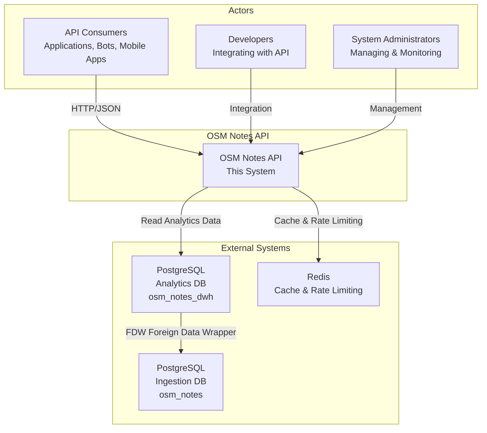
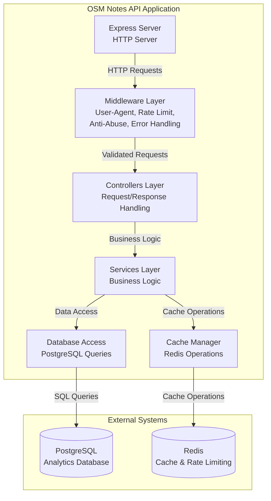
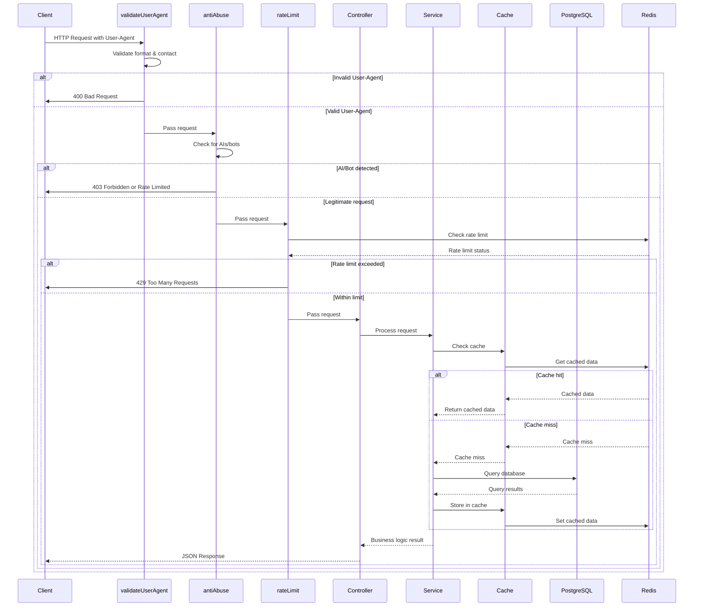
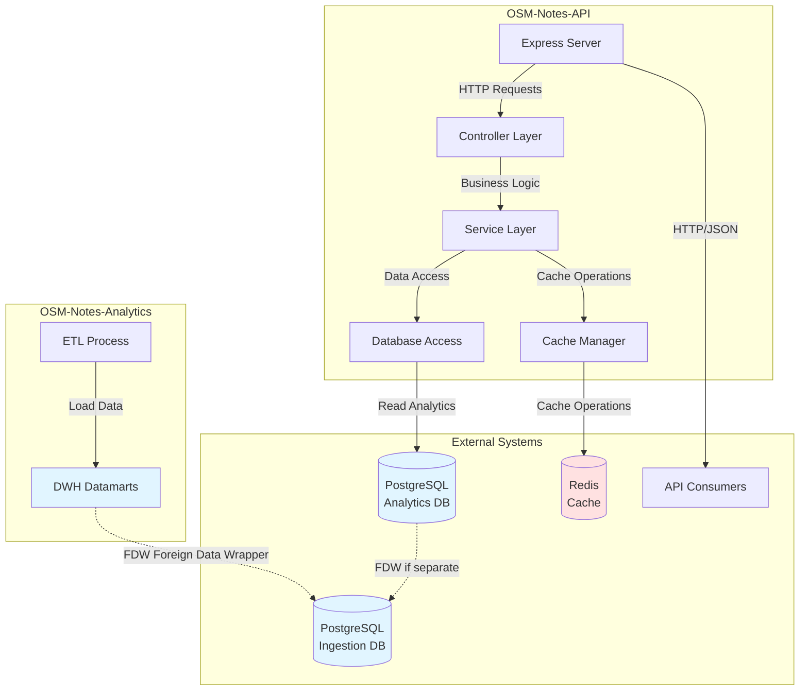
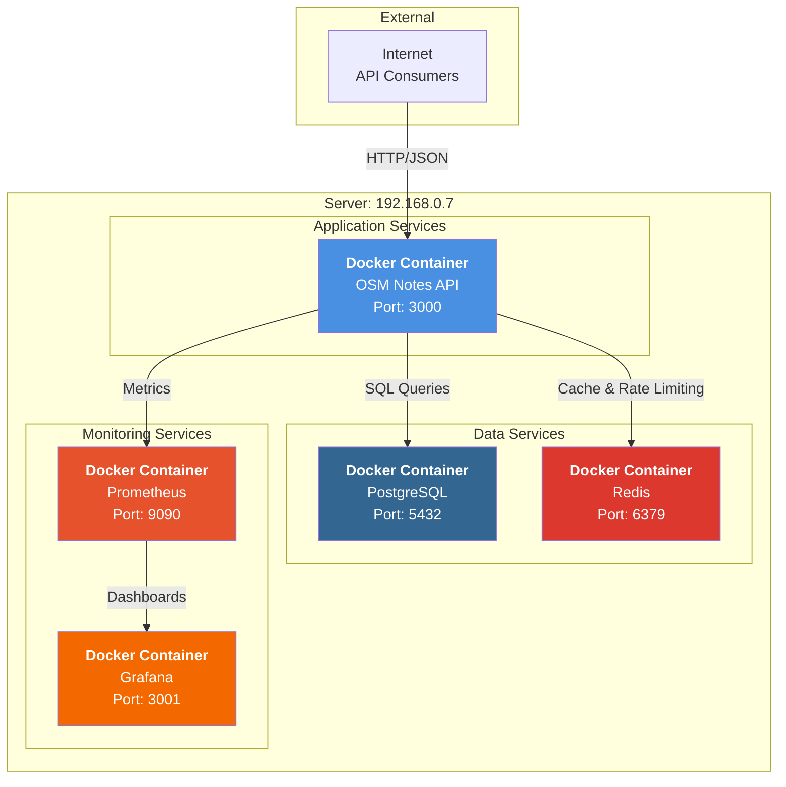

# Architecture Documentation

This document describes the architecture of OSM Notes API using the C4 Model.

## System Context (Level 1)

### Actors

- **API Consumers**: Applications, bots, mobile apps using the API
- **Developers**: Developers integrating with the API
- **System Administrators**: Managing and monitoring the API

### External Systems

- **PostgreSQL Analytics Database** (`osm_notes_dwh`): Contains datamarts and analytics data (from OSM-Notes-Analytics)
- **PostgreSQL Ingestion Database** (`osm_notes`): Contains raw notes data (from OSM-Notes-Ingestion, accessed via FDW)
- **Redis**: Cache and rate limiting storage

### OSM Notes Ecosystem

This API is part of the **OSM-Notes ecosystem**, consisting of 8 interconnected projects:

- **OSM-Notes-Ingestion** (base project): Provides base database (`osm_notes`)
- **OSM-Notes-Analytics**: Provides data warehouse (`osm_notes_dwh`) - **REQUIRED** for this API
- **OSM-Notes-API** (this project): REST API for programmatic access
- **OSM-Notes-Data**: JSON files exported from Analytics (served via GitHub Pages)
- **OSM-Notes-Viewer**: Web application consuming Data (complementary to this API)
- **OSM-Notes-WMS**: Web Map Service using Ingestion database
- **OSM-Notes-Monitoring**: Monitors all ecosystem components including this API
- **OSM-Notes-Common**: Shared libraries (not used by this API - Node.js project)

See the main [README.md](../../README.md) for complete ecosystem overview.

## Container Diagram (Level 2)

### Components

1. **Express Server**: HTTP server handling requests
2. **Middleware Layer**: 
   - User-Agent validation
   - Rate limiting
   - Anti-abuse protection
   - Error handling
   - Authentication (Phase 5)
3. **Controllers Layer**: Request/response handling
4. **Services Layer**: Business logic
5. **Database Access**: PostgreSQL queries
6. **Cache Manager**: Redis operations

## Component Diagram (Level 3)

### Request Flow

## Data Flow Diagram

## Deployment Architecture

## Technology Stack

- **Runtime**: Node.js 18+
- **Framework**: Express.js
- **Language**: TypeScript
- **Database**: PostgreSQL 15+
- **Cache**: Redis 7+
- **Testing**: Jest + Supertest
- **Monitoring**: Prometheus + Grafana
- **Containerization**: Docker + Docker Compose

## References

- [C4 Model](https://c4model.com/)
- [Architecture Decision Records](https://adr.github.io/)

